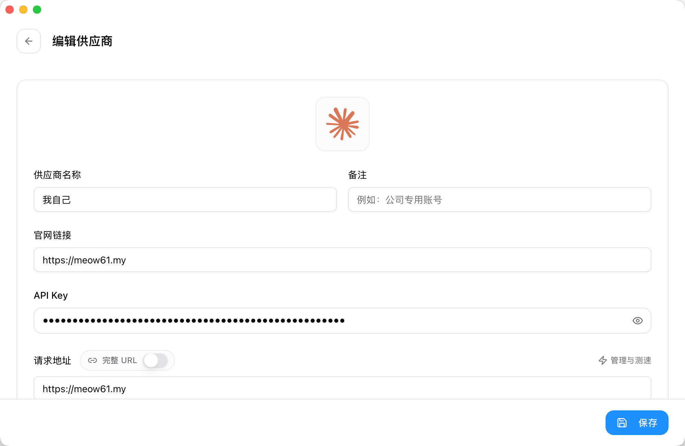

# CC Switch 接入教程

> CC Switch 是一个用于快速切换多个 API 服务商配置的开源工具。你可以把多个中转站 / 服务商的配置存起来，一键切换后同步到 Claude Code、Codex 等客户端或 CLI 中使用。

## 1. 准备工作

- 下载并安装 CC Switch（[官方仓库](https://github.com/farion1231/cc-switch) 或社区整合包均可）
- API 服务商的 API 地址和密钥（[水秋喵的小店购买后会在消息中显示](https://item.taobao.com/item.htm?ft=t&id=1063386359204)）

## 2. 添加供应商

1. 打开 CC Switch，点击 **添加供应商**。
2. 填写：
   - **名称**：方便识别的名字（例如「淘宝水秋喵」「水秋喵」）
   - **API 地址（Base URL）**：请求地址填 `https://meow61.my`
   - **API 密钥（API Key）**：对应密钥
3. 保存

## 3. 切换与同步

1. 在供应商列表中点击要启用的配置。
2. 点击 **启用** 到目标客户端。
3. 打开对应客户端即可使用切换后的配置。

## 4. 常见问题

### 切换后客户端里没生效？

- 确认切换的是当前客户端对应的配置组
- 重启客户端后再试试

### 请求地址填什么？

- 建议填 `https://meow61.my`
- 如果连接失败，可尝试带 `/v1` 的地址格式（参考[酒馆教程](./sillytavern)中的主/备地址）

### 速度很慢 / 报错 429？

- 尝试切换备用地址
- 可能触发了服务商的限流，稍后再试或更换模型
- 检查网络环境是否能正常访问 API 地址

## 5. 更多

- 官方仓库：[farion1231/cc-switch (GitHub)](https://github.com/farion1231/cc-switch)
