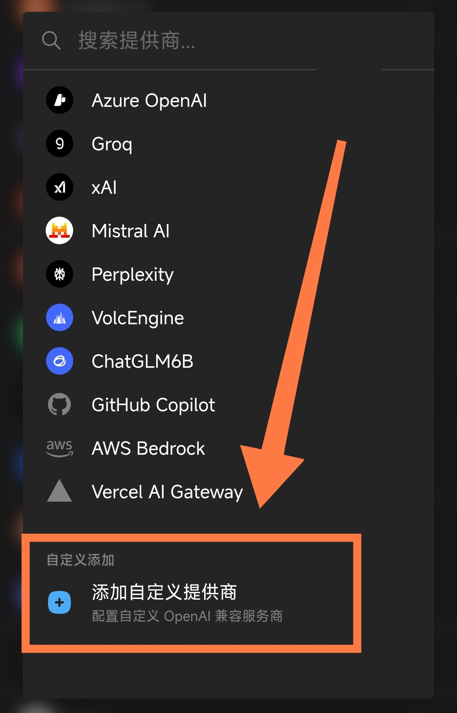
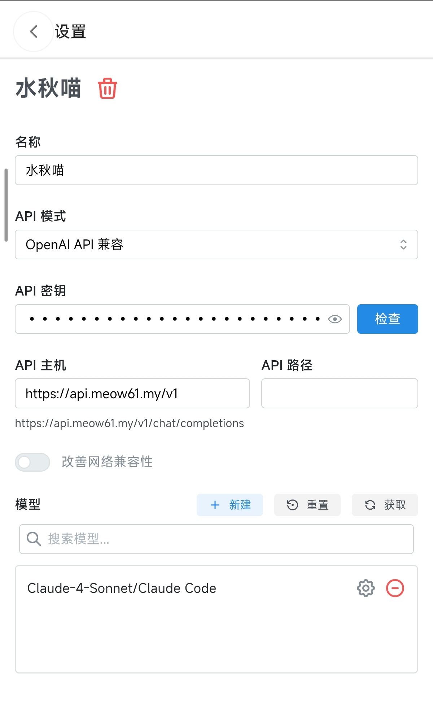

# ChatBox 接入教程

> ChatBox 是一款开源、跨平台的 AI 桌面客户端，支持 Windows / macOS / Linux，可以接入多种 API 服务商，包括自定义的 OpenAI 兼容接口。

## 1. 准备工作

- 下载并安装 ChatBox（[ChatBox官网](https://chatboxai.app/zh)）
- 一个 API 服务商的 API 地址和密钥（[水秋喵的小店购买后会在消息中显示](https://item.taobao.com/item.htm?ft=t&id=1063386359204)）

## 2. 配置

1. 打开 **设置**，选择 **模型提供方**。

2. 拉到列表**最下方**，选择 **添加**（添加自定义提供方）。

3. 将 **API 地址**填写到请求地址里，密钥填在 **API 密钥**里。
   - 主 API 地址：`https://api.meow61.my/v1`
   - 备用 API 地址：`http://link.meow61.my/v1`
4. 点击获取模型列表

5. 回到对话页，在顶部选择刚添加的提供方和模型即可开始对话。

## 3. 常见问题

### 提示 API 请求失败？

- 确认请求地址填写完整（是否漏了 `/v1` 之类的路径）
- 确认密钥已正确粘贴、没有多余空格
- 如果有开魔法（代理/VPN）的话，可用关闭魔法，本站点支持直连
- 更换备用地址测试

### 点了连接，模型列表是空的？

- 确认已添加模型名称，且与服务商提供的模型一致
- 重新进入设置，检查地址与密钥

### 速度很慢 / 报错 429？

- 尝试不使用魔法直连
- 尝试切换备用地址
- 可能触发了服务商的限流，稍后再试或更换模型
- 检查网络环境是否能正常访问 API 地址

### 如何切换多个模型？

- 在设置中添加多个模型，对话时顶部下拉即可切换

## 4. 更多

- 免安装直接使用：[网页版](https://web.chatboxai.app/)
- 官方仓库：[ChatBox (GitHub)](https://github.com/Bin-Huang/chatbox)
