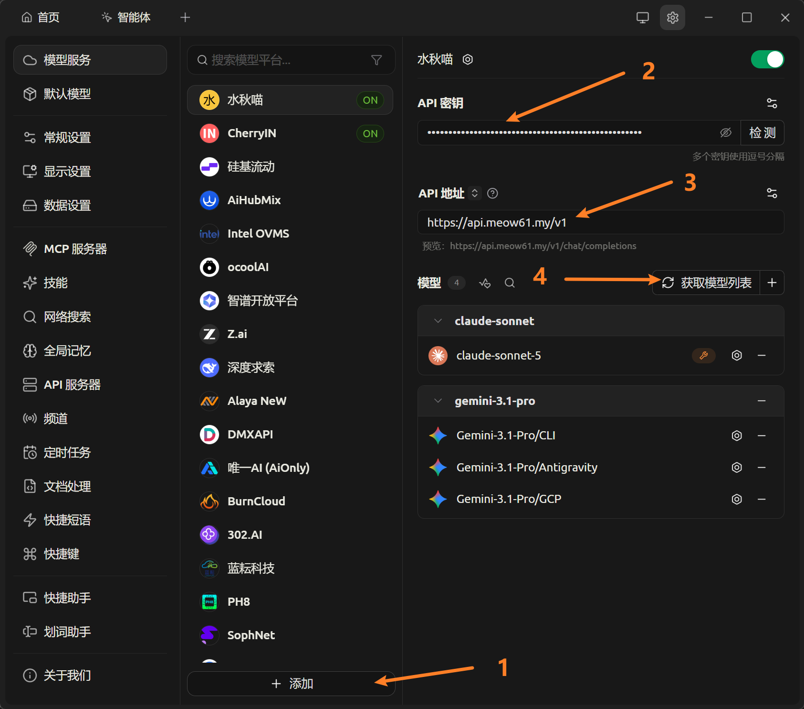

# Cherry Studio 接入教程

> Cherry Studio 是一款功能丰富的 AI 桌面客户端（PC 端推荐），支持 Windows / macOS / Linux，内置多个服务商，也支持添加自定义的 OpenAI 兼容接口。

## 1. 准备工作

- 下载并安装 Cherry Studio（[官方仓库](https://github.com/CherryHQ/cherry-studio) 或官网均可）
- 一个 API 服务商的 API 地址和密钥（[水秋喵的小店购买后会在消息中显示](https://item.taobao.com/item.htm?ft=t&id=1063386359204)）

## 2. 添加自定义服务商

1. 打开 Cherry Studio，进入 **设置** → **模型服务**。
2. 点击 **添加**，选择 **OpenAI 兼容** 或自定义服务商。
3. 填写：
   - **名称**：任意名称（例如「水秋喵」）
   - **API 地址（Base URL）**：
     - 主 API 地址：`https://api.meow61.my/v1`
     - 备用 API 地址：`http://link.meow61.my/v1`
   - **API 密钥（API Key）**：粘贴你的密钥
4. 点击 **管理模型**，添加要使用的模型名称。
5. 保存

## 3. 开始对话

在对话页左上角选择刚添加的服务商与模型，即可开始使用。

## 4. 常见问题

### 添加后看不到模型？

- 确认在「管理模型」里已添加模型名称
- 确认模型名称与服务商提供的完全一致

### 提示 API 请求失败？

- 确认 API 地址填写完整（是否漏了 `/v1` 之类的路径）
- 确认密钥已正确粘贴、没有多余空格
- 如果有开魔法（代理/VPN）的话，可用关闭魔法，本站点支持直连
- 更换备用地址测试

### 速度很慢 / 报错 429？

- 尝试不使用魔法直连
- 尝试切换备用地址
- 可能触发了服务商的限流，稍后再试或更换模型
- 检查网络环境是否能正常访问 API 地址

## 5. 更多

- 官方仓库：[CherryHQ/cherry-studio (GitHub)](https://github.com/CherryHQ/cherry-studio)
