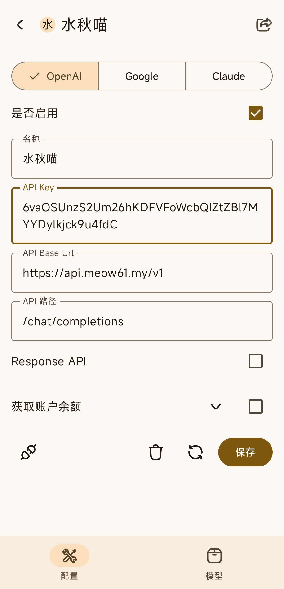

# RikkaHub 接入教程

> RikkaHub（Rikka）是一款手机端 AI 客户端（Android 端推荐），支持 OpenAI / Gemini / Claude 等多种接口格式，也支持添加自定义的中转服务商。

## 1. 准备工作

- 一台 Android 设备
- 安装 Rikka（[官方网站](https://rikka-ai.com/) 下载 APK，或 Google Play 商店）
- 一个 API 服务商的 API 地址和密钥（[水秋喵的小店购买后会在消息中显示](https://item.taobao.com/item.htm?ft=t&id=1063386359204)）

## 2. 添加服务商

1. 打开 Rikka，点击侧边栏底部的 **设置** 图标（齿轮）。
2. 选择 **提供商设置**。
3. 点击右上角 **新建** 一个提供商。
4. 填写：
   - **Base Url**：
     - 主 API 地址：`https://api.meow61.my/v1`
     - 备用 API 地址：`http://link.meow61.my/v1`
   - **API Key**：粘贴你的密钥
5. 点击 **保存**。

## 3. 添加模型

1. 在提供商配置页底部找到 **模型** 栏，点击进入。
2. 点击展开模型列表，勾选你要使用的模型（不需要的模型侧滑即可删除）。
3. 对话中随时可以通过聊天工具栏的模型选择器更换模型。

## 4. 配置默认模型

回到设置页面，选择 **默认模型和提示词**，配置各个功能模块的默认模型。除了对话模型，其他功能（如翻译、总结等）可以配置速度更快、价格更低的模型。

## 5. 开始第一次对话

1. 返回主界面，开启新对话。
2. 点击底部左侧的模型选择按钮，选择你希望使用的模型。
3. 在底部文本框中输入消息并发送，Rikka 会实时流式输出回复。

## 6. 常见问题

### 提示 API 请求失败？

- 确认 Base Url 填写完整（是否漏了 `/v1` 之类的路径）
- 确认密钥已正确粘贴、没有多余空格
- 如果有开魔法（代理/VPN）的话，可用关闭魔法，本站点支持直连
- 更换备用地址测试

### 速度很慢 / 报错 429？

- 尝试不使用魔法直连
- 尝试切换备用地址
- 可能触发了服务商的限流，稍后再试或更换模型
- 检查网络环境是否能正常访问 API 地址

### 问模型"你是什么模型"它答不上来？

这是大模型的原理导致的，模型并没有准确的自我认知。RikkaHub 默认不会内置系统提示词，想让它准确回答身份问题，可以在提示词设置里配置。

## 7. 更多

- 官方网站：[rikka-ai.com](https://rikka-ai.com/)
- 官方文档：[快速上手：5 分钟内发送第一条 AI 消息](https://docs.rikka-ai.com/zh/quickstart)
