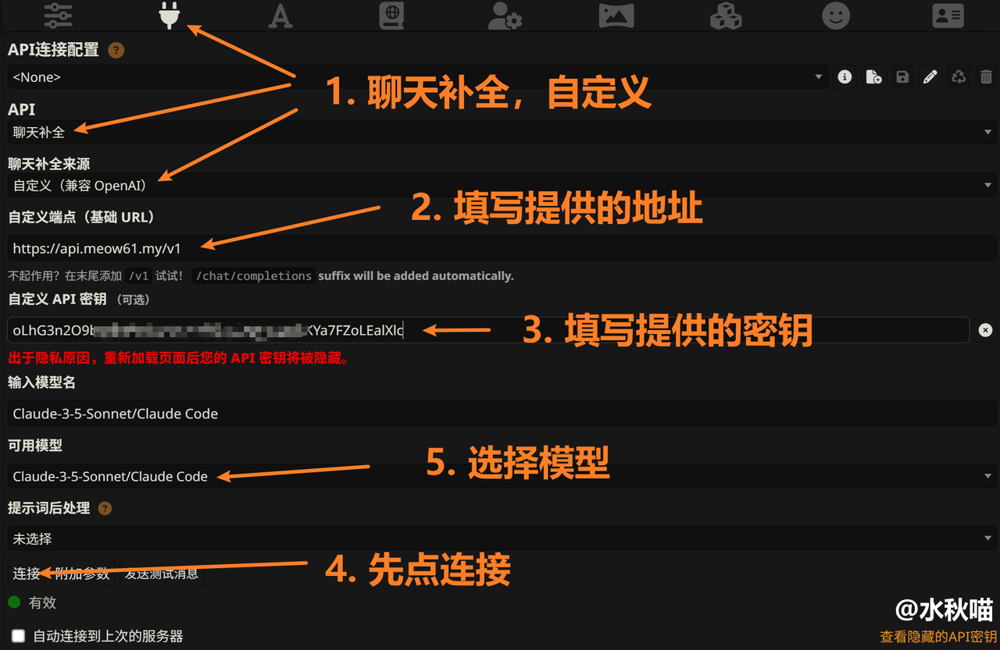

# 酒馆 (SillyTavern) 接入教程

> SillyTavern（简称酒馆 / ST）是一个本地运行的开源 AI 角色扮演聊天前端，通过 API 连接各种大语言模型服务。

## 交流方式

酒馆交流群：**273521267**

1. 群申请消息请认真填，为防止炸群，QQ 等级为 10 级以下的小号不能进群。
2. 群友们都很~~猪咪~~可爱，不用担心融入不了群，但不要把互联网上的戾气带来群里。
3. 请不要潜水，当群满后将会不得不踢掉长时间无聊天记录的群友（可以重新进群）。
4. 可以向群友们询问酒馆相关内容，会有好心的群友们帮忙解答。注意基本的提问礼貌，提供截图等所需内容。
5. 如遇到 API 连接问题，如果是简单的问题可以在群里问问，复杂问题请直接私聊群主**水秋喵**。

## 1. 准备工作

- 一个已经部署好的酒馆（不会部署？[看宝宝教程](https://sqivg8d05rm.feishu.cn/wiki/MjmdwyjpRihXabkrhMkchcMhnEh)）
- 一个 API 服务商的 API 地址和密钥（[水秋喵的小店购买后会在消息中显示](https://item.taobao.com/item.htm?ft=t&id=1063386359204)）

## 2. 连接

1. 点击插头，**API 选聊天补全**，聊天补全来源选**自定义**。
2. 将 **API 地址**填写到自定义端点里，密钥填在**自定义 API 密钥**里。
   - 主 API 地址：`https://api.meow61.my/v1`
   - 备用 API 地址：`http://link.meow61.my/v1`
3. 先点**连接**，等可用模型列表出现模型，选择你想要的模型。
   - （纯萌新不知道选什么模型？就先选 Gemini 或者可爱的 DeepSeek 吧）
4. 选择角色卡，直接尝试聊天吧
   - （不要点测试信息，它就是向 AI 发个 Hi，发失败了也不证明真的不可用，发成功了还扣你钱）

## 3. 常见问题

### 点击连接，连接失败/模型列表是空的？

1. 检查填写是否正确
   - 确认自定义端点地址填写完整（是否漏了 `/v1` 之类的路径）
   - 确认密钥已正确粘贴、没有多余空格，以 `sk-` 开头
2. 确认网络正常连接
   - 如果有开魔法（代理/VPN）的话，可用关闭魔法，本站点支持直连
   - 重新点一次**连接**，等待可用模型列表刷新
   - 更换备用地址测试

### 速度很慢 / 报错 429？

- 尝试不使用魔法直连
- 尝试切换备用地址
- 可能触发了服务商的限流，稍后再试或更换模型
- 检查网络环境是否能正常访问 API 地址

## 4. 更多

- 宝宝教程：[酒馆使用](https://sqivg8d05rm.feishu.cn/wiki/J8NDwc06JiuHXmk5cP2csfP6nmd)
- 官方仓库：[SillyTavern / SillyTavern (GitHub)](https://github.com/SillyTavern/SillyTavern)
